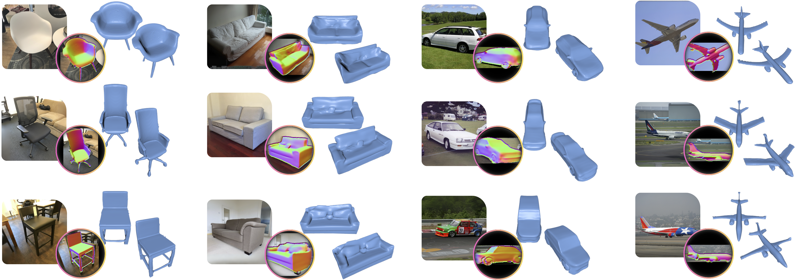

<!-- header container removed -->
<h1 align="center">SDFit: 3D Object Pose and Shape by Fitting a Morphable SDF to a Single Image</h1>

<p align="center">
    <a href="https://anticdimi.github.io/">Dimitrije Antić</a><sup>1</sup>
    &nbsp;&nbsp;
    <a href="https://gpaschalidis.github.io/">Georgios Paschalidis</a><sup>1</sup>
    &nbsp;&nbsp;
    <a href="https://sha2nkt.github.io/">Shashank Tripathi</a><sup>2</sup>
    &nbsp;&nbsp; <br>
    <a href="https://staff.fnwi.uva.nl/th.gevers/">Theo Gevers</a><sup>1</sup>
    &nbsp;&nbsp;
    <a href="https://saidwivedi.in/">Sai Kumar Dwivedi</a><sup>2</sup>
    &nbsp;&nbsp;
    <a href="https://dtzionas.com/">Dimitrios Tzionas</a><sup>1</sup>
    <br/>
    <sup>1</sup> University of Amsterdam, The Netherlands &nbsp;&nbsp;&nbsp;&nbsp;<br> <sup>2</sup> Max Planck Institute for Intelligent Systems, Tübingen, Germany
</p>

<h3 align="center">ICCV 2025</h3>

<p align="center">
    
</p>

<p align="center">
    <a href="https://arxiv.org/abs/2409.16178">
        
    </a>
    &nbsp;&nbsp;
    <a href="https://anticdimi.github.io/sdfit/">
        
    </a>
</p>

<p align="center">
    🔗
    <a href="#-setup">Setup</a>
    •
    <a href="#-running-sdfit">Run</a>
    •
    <a href="#-citation">Citation</a>
    •
    <a href="#-code-release-status">Status</a>
 </p>

---

##  🔧 Setup
To clone the repository, run:
```bash
git clone --recurse-submodules https://github.com/anticdimi/sdfit.git
```

To use our method, you need to download pretrained _Deep Implicit Templates_ checkpoints from [here](https://github.com/ZhengZerong/DeepImplicitTemplates/tree/master/pretrained), and place them in the `./pretrained` folder.

```bash
export CONDA_CMD=mamba # (or conda if you use conda)
$CONDA_CMD create -n sdfit_env python=3.10 -y
$CONDA_CMD activate sdfit_env

$CONDA_CMD install -c conda-forge gcc_linux-64=12.2.0 gxx_linux-64=12.2.0 ffmpeg x264 -y

pip install torch==2.3.0+cu121 torchvision torchaudio --index-url https://download.pytorch.org/whl/cu121

wget https://anaconda.org/pytorch3d/pytorch3d/0.7.8/download/linux-64/pytorch3d-0.7.8-py310_cu121_pyt231.tar.bz2
$CONDA_CMD install pytorch3d-0.7.8-py310_cu121_pyt231.tar.bz2
rm -rf pytorch3d-0.7.8-py310_cu121_pyt231.tar.bz2

python assets/test_torch_p3d_install.py

pip install opencv-python tqdm pre-commit scikit-learn iopath omegaconf plyfile scikit-image tensorboardX h5py tensorboard trimesh matplotlib accelerate huggingface_hub==0.23.0 diffusers==0.21.4 xformers==0.0.26.post1 transformers==4.26.1 git+https://github.com/anticdimi/videoio.git git+https://github.com/NVlabs/nvdiffrast.git
```
## 📋 Code Release Status

We will release our code in two stages:
- [x] Demo
- [ ] Full Framework w/ detailed instructions about steps (_est. December_)

## 🚀 Running SDFit
For running the demo, download the demo example from [here](https://drive.google.com/file/d/1G2spZtiwg5B5dCUZYZklVo1OIv_mCLRj/view?usp=sharing), and place it under `${YOUR_DEMO_PATH}`.

### 🧪 Demo
After setting up your environment, and downloading the demo example, run:
```bash
python -m sdfit cfg/default.yaml data.input_path=${YOUR_DEMO_PATH}
```

## 📚 Citation
If you find this code useful for your research, please consider citing: &nbsp;
```bibtex
@inproceedings{antic2025sdfit,
    title     = {{SDFit}: {3D} Object Pose and Shape by Fitting a Morphable {SDF} to a Single Image},
    author    = {Anti\'{c}, Dimitrije and Paschalidis, Georgios and Tripathi, Shashank and Gevers, Theo and Dwivedi, Sai Kumar and Tzionas, Dimitrios},
    booktitle = {Proceedings of the IEEE/CVF International Conference on Computer Vision (ICCV)},
    month     = {October},
    year      = {2025},
}
```

## 🙏 Acknowledgements
Our method builds upon prior open-source efforts. We thank the authors for releasing their code and models: [Deep Implicit Templates](https://github.com/ZhengZerong/DeepImplicitTemplates), [nvdiffrast](https://github.com/NVlabs/nvdiffrast), [FlexiCubes](https://github.com/nv-tlabs/FlexiCubes), [OpenShape](https://github.com/Colin97/OpenShape_code), and [Diff3F](https://github.com/niladridutt/Diffusion-3D-Features).